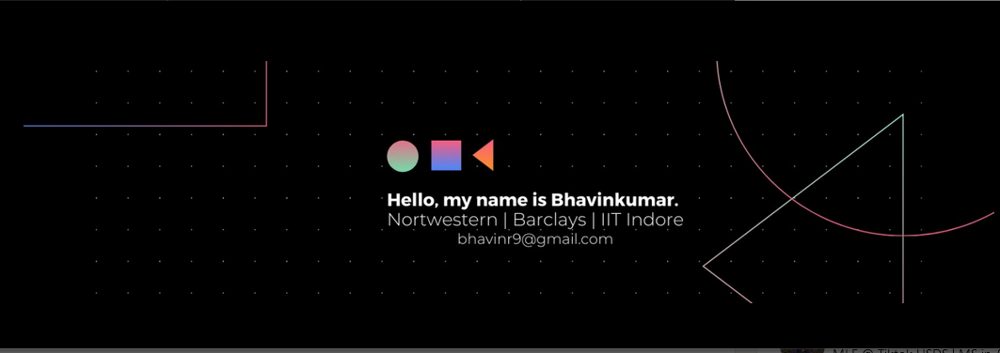

# Oi, World! I'm Bhavin 👋

I'm an **AI / ML Engineer** with a passion for converting models into services. I've been into Gaming since early childhood and OpenAI's Five in 2018 is what got me into AI and I've never looked back since. I specialize in creating E2E solutions with AI and love all things AI in general. 

While I started my journey with **Deep Learning** and applications of AI in **Signal Processing**, I've built an extensive skillset around **Natural Language Processing** and **Large Language Models** in the recent years and have helped multiple organizations with their AI Revolution. From Building Foundational Data Pipelines to standardize data processing to building End to End AI Solution pipelines that are not only **Fast** and **Resource Efficient**, but also **Modular** and **Extendable** to similar Problem sets, I've done it all!

- 💼 Interested in working together? Reach out to me via <a href="mailto:bhavinr9@gmail.com">email.</a>
- 💬 Got a question or just curious about something? Feel free to ask!

<code></code>
<code></code>
<code></code>
<code></code>
<code></code>
<code></code>

## 💼 Work Experience 

**Kellogg School of Management**

Worked as : **AI Researcher for Global Poverty Research Lab (GPRL)**

I worked as the **foundational AI Researcher** for GPRL labs and helped then extract key data points from Poverty Research Papers using LLM Powered Dashboards. During my tenure, I have engineered their first of a kind Dual Mode Dashboard for Data extractions that **switches** between **Live inference** and **Batch Inference modes** in order to facilitate PDF Data Extraction in Burst as well as Bulk Mode.

**Automating Manual Workflows with LLMs** : By Automating their Manual Workflows with AI, I helped them reduce their operational costs by upto 60% and eliminated redundant human-in-the-loop, streamlining their workflow in the process. 

**Multistage Querying Pipelines** : To address complicated context based questions, I developed a **novel Bookmark Dictionary Data representation format** that **compressed the size of PDF text by over 75%** and developed multi-stage extraction pipelines that allows extraction of complicated queries at a **fraction of original extraction cost**. 

**Alo Index** 

Worked as : **AI Engineering Intern** 

Over the Summer of '24, I interned at Alo Index as an AI Intern and helped them with their AI Revolution. While the official title of my employment was in form of an internship, I essentially functioned as their Lead AI Developer and helped them integrate AI into their Business Critical Workflows. 

**Data Pipelines** : A crucial contribution of mine during my tenure was standardizing and automating Feature Store creations with **Cloud Native Data Processing Pipelines**. I helped them build their first pipelines to generate various feature sets from Raw data to fast-track AI solution development. 

**Image Classification Solutions** : I engineered their first Distance-to-Cluster based Image Classification algorithms that helped them reduce their workflow backlogs by 80%. 

**Text Base Solutions**: By Leveraging the Language Capabilities of Self-Hosted LLMs, I built out E2E Dashboards for their Text Based verification Use-Cases, effectively cutting their Verification times by 60%. 

<code> </code>
 Worked as : **Graduate Analyst (B.A.4)**

- **SpringBoot Developer** : I started my professional career as a Java Developer mainly developing SpringBoot APIs for Barclays' Central Data Repository Team. I excel in developing **Clean**, **Lean** and **Scalable** **REST APIs**. This was the time I devoted solely to learning the ropes of **Scalable Systems** and while polishing my **DevOps** skills on the way. I worked with **MongoDB** on a day-to-day basis and safe to say, I have developed an in-depth understanding in this Domain.
  
- **Full Stack** : As part of Stretch Assignments, I often worked on internal Team tools using **MERN** stack. Most Notably, I engineered the integration of various Internal tools into a single Portal that reduced the resource consumption by **over 60%** and tied seamless SSO based Sign-ins to further increase the efficacy of the tools.

- **GraphQL** : Over my 2 year tenure at Barclays, I often dabbled in GraphQL API development as well. Though Limited, I do have experience in building sub 200ms APIs here as well!  

## 📈 My GitHub stats

  

    
    
  

---
